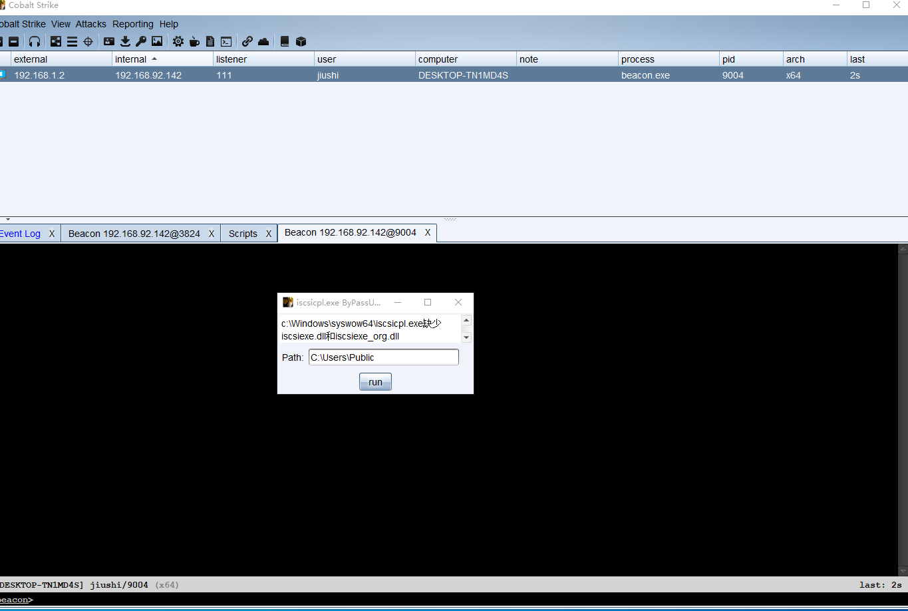
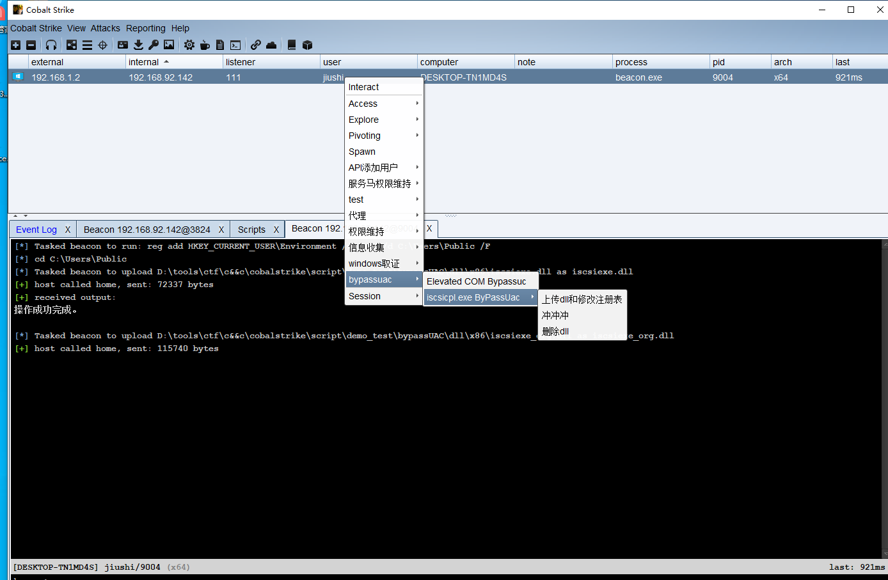
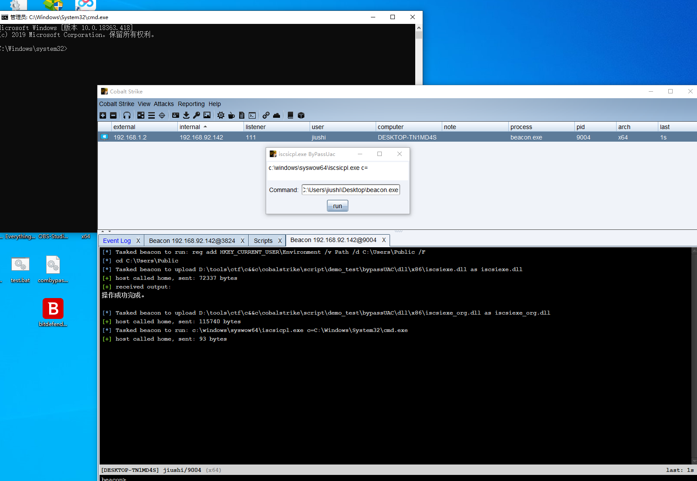
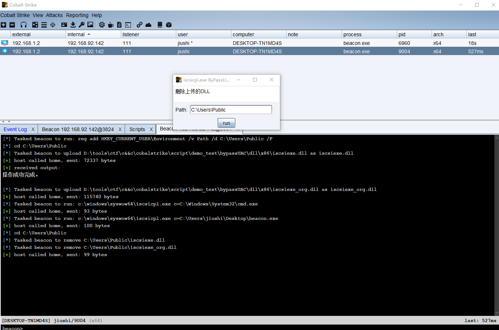

## bypassUC ##
* ICMLuaUtil::ShellExec Bypassuac
* iscsiexeBypassUac

### ICMLuaUtil::ShellExec Bypassuac ###
参考链接:https://y4er.com/post/bypassuac-with-icmluautil/  

如果执行没反应，检查终端是否出现:Opened: Scripts with no remove listener,如果有，重新连接cs即可解决  

### iscsiexeBypassUac ##

