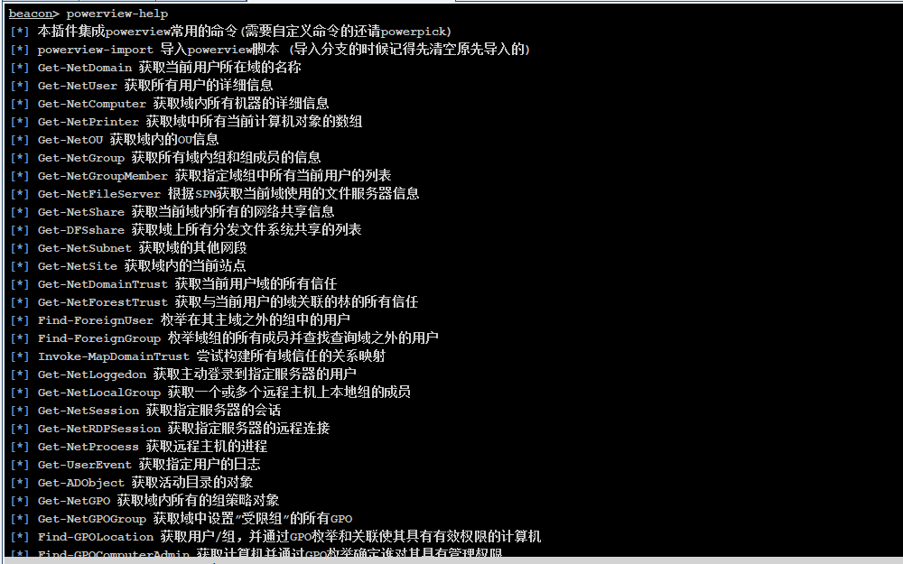
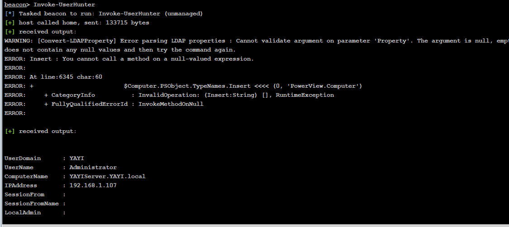
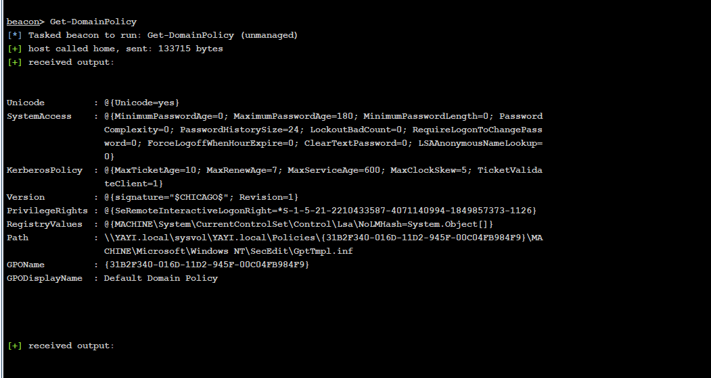
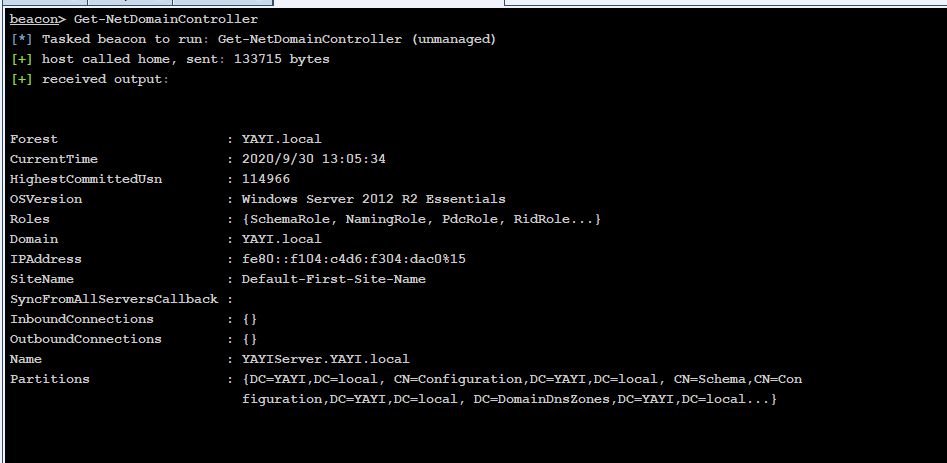
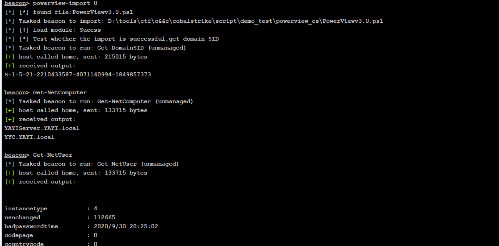
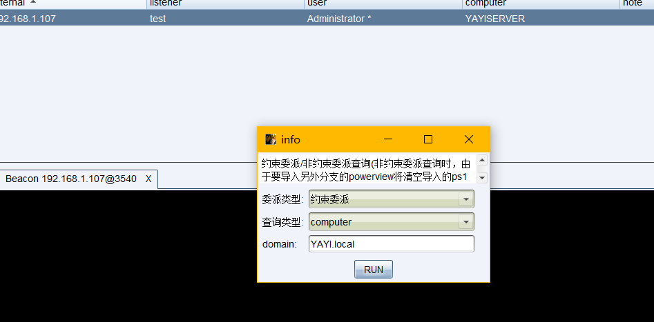
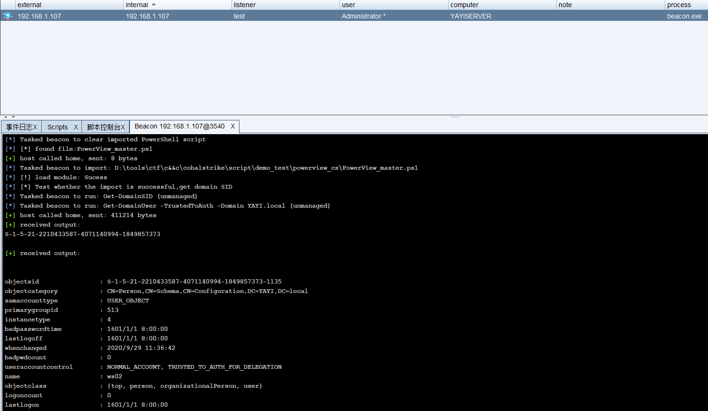

## powerview ##
导入PowerView脚本，和常见的功能使用
```
powerview-import 1 导入master分支的powerview.ps1
powerview-import 0 导入dev分支的powerview.ps1
```

集成常见的命令
```
Get-NetDomain 获取当前用户所在域的名称
Get-NetUser 获取所有用户的详细信息
Get-NetDomainController 获取所有域控制器的信息
Get-NetComputer 获取域内所有机器的详细信息
Get-NetPrinter 获取域中所有当前计算机对象的数组
Get-NetOU 获取域内的OU信息
Get-NetGroup 获取所有域内组和组成员的信息
Get-NetGroupMember 获取指定域组中所有当前用户的列表
Get-NetFileServer 根据SPN获取当前域使用的文件服务器信息
Get-NetShare 获取当前域内所有的网络共享信息
Get-DFSshare 获取域上所有分发文件系统共享的列表
Get-NetSubnet 获取域的其他网段
Get-NetSite 获取域内的当前站点
Get-NetDomainTrust 获取当前用户域的所有信任
Get-NetForestTrust 获取与当前用户的域关联的林的所有信任
Find-ForeignUser 枚举在其主域之外的组中的用户
Find-ForeignGroup 枚举域组的所有成员并查找查询域之外的用户
Invoke-MapDomainTrust 尝试构建所有域信任的关系映射
Get-NetLoggedon 获取主动登录到指定服务器的用户
Get-NetLocalGroup 获取一个或多个远程主机上本地组的成员
Get-NetSession 获取指定服务器的会话
Get-NetRDPSession 获取指定服务器的远程连接
Get-NetProcess 获取远程主机的进程
Get-UserEvent 获取指定用户的日志
Get-ADObject 获取活动目录的对象
Get-NetGPO 获取域内所有的组策略对象
Get-NetGPOGroup 获取域中设置”受限组”的所有GPO
Find-GPOLocation 获取用户/组，并通过GPO枚举和关联使其具有有效权限的计算机
Find-GPOComputerAdmin 获取计算机并通过GPO枚举确定谁对其具有管理权限
Get-DomainPolicy 获取域默认策略或域控制器策略
Get-DomainSID 返回指定域的SID
Invoke-UserHunter 获取域用户登录的计算机信息及该用户是否有本地管理员权限
Invoke-ProcessHunter 通过查询域内所有的机器进程找到特定用户
Invoke-UserEventHunter 根据用户日志查询某域用户登陆过哪些域机器
Invoke-ShareFinder 在本地域中的主机上查找（非标准）共享
Invoke-FileFinder 在本地域中的主机上查找潜在的敏感文件
Find-LocalAdminAccess 在域上查找当前用户具有本地管理员访问权限的计算机
Find-ManagedSecurityGroups 搜索受管理的活动目录安全组并标识对其具有写访问权限的用户，即这些组拥有添加或删除成员的能力
Get-ExploitableSystem 发现系统可能易受常见攻击
Invoke-EnumerateLocalAdmin 枚举域中所有计算机上本地管理员组的成员
```













