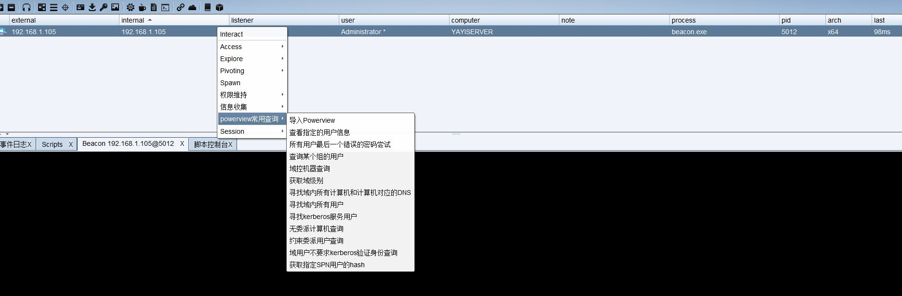
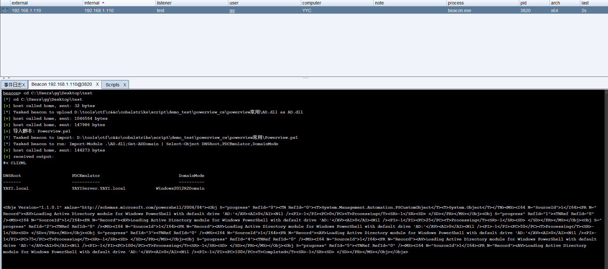

## powerview查询 ##

修复了2008等需要依赖`Microsoft.ActiveDirectory.Management.dll`通常导入powerview.ps1缺少的依赖

## 更新记录 ##
2021/2/5 修复了2008等需要依赖`Microsoft.ActiveDirectory.Management.dll`通常导入powerview.ps1缺少的依赖  
2021/2/5  新增功能`枚举在Domain Admins组等之类高权限组的用户`  
