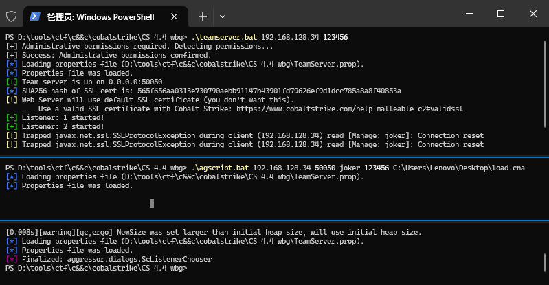
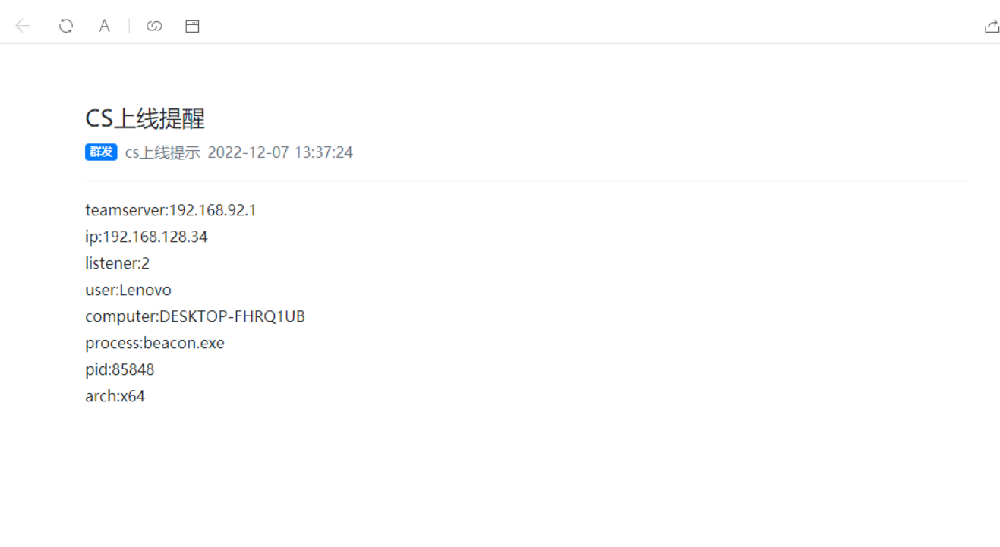

1.登录 http://www.pushplus.plus/  
2.创建群组 (wx扫码加入群组)  
3.修改plus.py里的token和topic (topic为你设置的群组编码)  
4.cs加载该插件 or `nohup sudo ./agscript <cs_ip> <port> <user> <pass> load.cna  2>&1 &`  
参考链接:https://xz.aliyun.com/t/10698  

